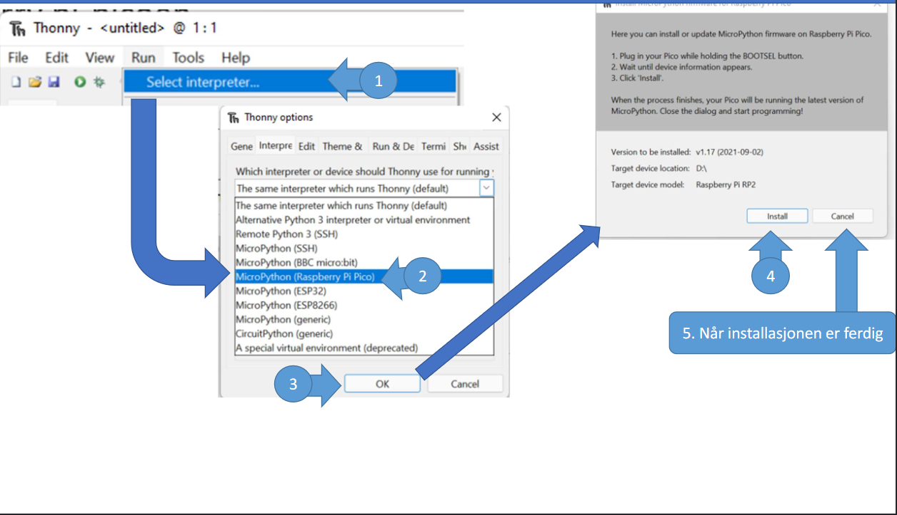
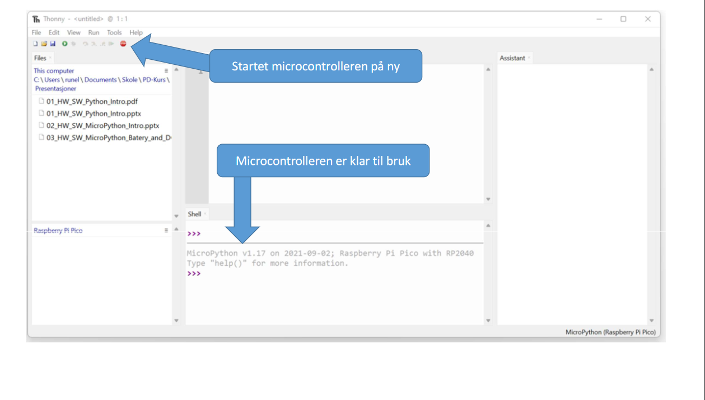

# USN-Micro-Smartcar-2022
En autonom modellbil som følger sort linje.

Instruksjon for å sette opp bilen og få programvaren til å fungere.
- Thonny IDE set-up, for å kunne laste ned programvaren et sted. Viser trinnvis hvordan man gjør det
- - Følg lenke under kapittel "Set-up for Sensor (APDS9900)" for få tilgang til sensor bibliotek, følg instruksjonene der.
- Instruksjon for å sette opp koden til å få bruke bilen funksjoner og definisjoner

# Dokumentasjon

# Thonny IDE set-up
Installering av thonny IDE og micropython

Steg 1: Installer thonny ved å trykke på linken: https://thonny.org/

Steg 2: Når thonny er installert, kan man installere micropython (se bilder)

# Set-up for Sensor (APDS9900)
Gå til denne lenken https://github.com/rlangoy/uPy_APDS9960  for å se hvordan sensoren skal settes opp.

**Viktig å velge APDS9900 og ikke APDS9960!**

# Installering av programvare (main.py)
Steg 1: Last ned koden og pakk ut zip-fil

Steg 2: Åpne main.py i thonny og last opp koden til micropython (bilde)

Nå som man har både programvaren til snesorene og main.py lastet opp på micropython, så er den good to go.

# Hardware Set-up

