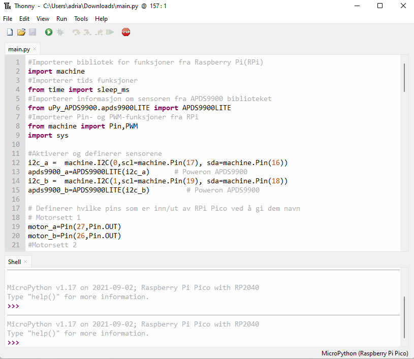
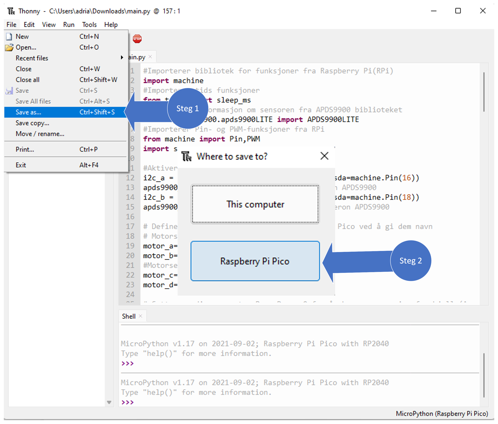
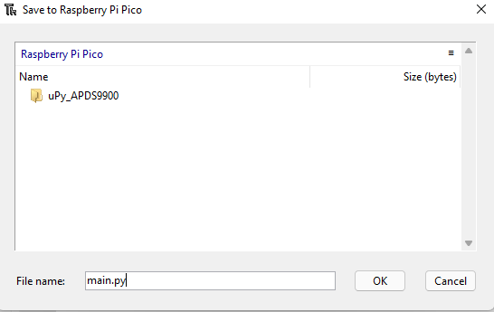

# USN-Micro-Smartcar-2022
En autonom modellbil som følger sort linje.

Etter å ha fulgt stegene for å laste ned og sette opp thonny, så kan følge instruksjonene her for å sette opp programvaren

Instruksjon for å sette opp bilen og få programvaren til å fungere.
- Thonny IDE set-up, for å kunne laste ned programvaren et sted. Viser trinnvis hvordan man gjør det
- Følg lenke under kapittel "Set-up for Sensor (APDS9900)" for få tilgang til sensor bibliotek, følg instruksjonene der.
- Instruksjon for å sette opp koden til å få bruke bilen funksjoner og definisjoner

# Set-up for Sensor (APDS9900)
Gå til denne lenken https://github.com/rlangoy/uPy_APDS9960  for å se hvordan sensoren skal settes opp.

**Viktig å velge APDS9900 og ikke APDS9960!**

# Installering av programvare - main.py
Steg 1: Last ned koden og pakk ut zip-fil.

Åpne main.py i Thonny, slik vil den da se ut.

Steg 2: Mens koden er åpen i Thonny og mikrokontrolleren er koblet til PC-en, lagre koden i micropython. **Viktig at du lagrer med samme navn!**

Nå som man har både programvaren til sensorene og main.py lastet ned på micropython, så er den klar til bruk.

